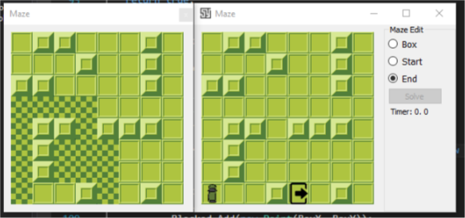

# Maze-Solver
Maze Algorithm
You’ve landed on an alien planet, in the middle of some strange maze, and you want to find the quickest way out. 
The maze can be thought of as a m×n grid where some of the squares in the grid are blocked. You know the entire maze (including the size of the grid, which squares are blocked, and your current location). You can drive north, south, west, or east from each square in your hovercar, but not diagonally. Unfortunately, your hovercar was damaged during the rough landing onto the planet, and it can’t turn left or make U-turns: the hovercar can only go straight or turn right. For instance, if you leave the current square by going north, you’ll only be able to leave the next square by going north or east; west is not possible, because that would require a left turn, and south is not possible either, because would require a U-turn. Your hovercar was landed facing north, so on your first move you will need to drive north. 
Find an efficient algorithm to find the shortest route to escape from the maze and implement it.

